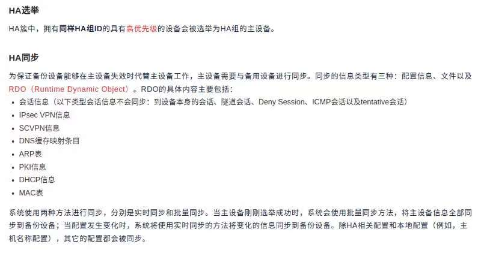

# 链路负载均衡
依托mwan3进行配置，但是要有独特的配置逻辑
比如说：相关负载均衡绑定在特定的静态目的路由上：0.0.0.0/0路由逻辑

# 应用负载均衡

目前还没有真正的竞品，主要有haproxy+keepalived和lvs+keepalived方案。

## 主要概念
- 虚拟服务器(virtual server)
  - 配置1：虚拟服务器类型
    - 1.http
    - 3.域名路由
    - 4.mysql
    - 5.postgresql
    - 6.ssl
    - http-3xx重定向（可能在均衡算法上有限制）
  - 配置2：虚拟服务器下游
  - 配置3：ssl加密
  虚拟服务器有一个配置：下游，下游可以配置多个服务(service object)
  - 配置4：会话保持
  
- 服务(service object)

- 服务器(real service)

- 服务器组(real service group)

- 健康检查模板(health-check template)
  可以配置两种类型的模板：1.健康检查，2.健康检查组
  ui上是一个列表，列表可以按多种项目属性排列。最重要的是：健康检查和健康检查组同时出现在一个表中。模板类型属性有两种取值：1.健康检查，2.健康检查组

- 健康检查：可以配置http、https等类型的健康检查。

- 健康检查组：可以讲几个健康检查合在一起看作模板。

- 目前只需要支持将健康检查模板绑定在虚拟服务器上
## HA

  
## dns监视和代理
  劫持所有的53端口流量
## 营销亮点
1.一次购买，终身免费，没有任何许可证到期的问题，免费提供安全更新
2.只销售软件，硬件可以随便换，但是通常是代购主流工控机，然后把整机包括软件一同交付（带加密芯片）。售前付费属于服务费用，不属于产品整体费用。
3.如果您对我们裸奔的服务体验不放心，您可以加钱购买我们的后期服务，包括一次性服务和长期运维保障服务，一次性服务按次数付费，长期运维保障服务按时长付费，我们的服务多种多样，你想掏多少钱我们就可以攒出多贵的服务，我们做的方案保证榨干您的钱包。x
